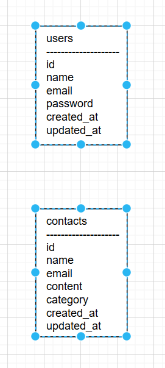

Attendance Management
環境構築

Dockerビルド

docker compose up -d --build

コンテナに入る

docker exec -it third-php bash

マイグレーション実行

php artisan migrate

使用技術(実行環境)

PHP 8.1.33

Laravel 10.49.0

MySQL 8.0

Nginx 最新版

phpMyAdmin

ER図

URL

開発環境: http://localhost:8080/
